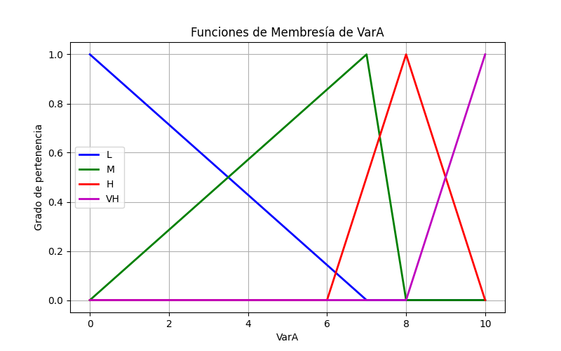

# PEC3 - 2023

Contiene la PEC 3 - 2023

# Tabla de contenidos

1. [Detalles técnicos](#detalles-tecnicos)
2. [PEC 3 Solucion](#pec-3-solucion)
3. [Third Example](#third-example)
4. [Fourth Example](#fourth-examplehttpwwwfourthexamplecom)

# Detalles técnicos

## Configuración de VS Code

Para configurar VS Code y tener el entorno listo, sigue estos pasos.

### Crear el entorno virtual

Primero, ve a la carpeta del proyecto y ejecuta:

``` 
python -m venv venv
```

### Activar el entorno virtual

Depende del sistema operativo (OS).

__Linux__

```
source venv/bin/activate
```

__Windows (Power shell)__

```
venv\Scripts\Activate.ps1
```

__Windows (Command prompt)__

```
venv\Scripts\activate
```

### Instalar dependencias

En este caso no es necesario, pero lo dejamos comentado para reutilizarlo en otros proyectos:

```
pip install -r requerimientos.txt
```

En caso de querer hacerlo directamente: 

´´´
pip install numpy matplotlib

´´´

### Ejecutar los programas

Para ejecutar los programas usar las instrucciones de línea de comando:

´´´
python3 vl_vara.py
python3 vl_varb.py
python3 vl_varc.py
python3 vl_vard.py
´´´


# PEC 3 Solucion

## Pregunta 1

Dar el detalle de las funciones de pertenencia de cada uno de lor términos lingüísticos de cada una de las cinco variables del sistema.

Las variables se presentan en la tabla:

| Variable | Rango (min, max) | Término lingüístico (a,b,c,d) |
| :-- | :-- | :-- |
| VarA | (0, 10) | L: (0, 0 ,0 ,7)  <br> M: (0, 7, 7, 8) <br> H: (6, 8, 8, 10) <br> VH: (8, 10, 10, 10) |
| VarB | (0, 9) | L: (0, 0 ,0 ,4)  <br> M: (2, 3, 7, 8) <br> H: (4, 8, 8, 9) |
| VarC | (0, 2) | VL: (0, 0 ,0.2 ,0.6) <br> L: (0, 0.4 , 0.6, 1.4)  <br> M: (0.8, 1.0, 1.0, 1.2) <br> H: (0.6, 1.4, 1.6, 2.0) <br> VH: (1.4, 1.8, 2.0, 2.0) |
| VarD | (0, 2) | L: (0, 0 ,0 ,1)  <br> M: (0,1,1,2) <br> H: (0, 1, 2, 2) |
| OutB1 <br> OutB2 <br> OutB3 <br> OutB4 | (0, 10) | VL: (0, 0 ,0 ,1) <br> L: (0, 2 ,2 ,3)  <br> M: (2, 4, 5, 6) <br> H: (5, 6, 6, 9) <br> VH: (7, 8, 10, 10) | 

### Var A

The graphical representation of Var A is:



Función de pertenencia μ(L):

μ(L) = $\left\{\begin{array}{ll}0 & \text{si } x \leq 0, \\\frac{7-x}{7} & \text{si } 0 < x \leq 7, \\0 & \text{si } x > 7.\end{array}\right.$

Tipo: Triangular

Función de pertenencia μ(M):

μ(M) = $\left\{\begin{array}{ll}0 & \text{si } x \leq 0, \\\frac{x}{7} & \text{si } 0 < x \leq 7, \\ 8 - x & \text{si } 7 < x \leq 8, \\0 & \text{si } x > 8.\end{array}\right.$

Tipo: Triangular

Función de pertenencia μ(H):

μ(H) = $\left\{\begin{array}{ll}0 & \text{si } x \leq 6, \\\frac{x-6}{2} & \text{si } 0 < x \leq 1, \\\frac{10-x}{2} & \text{si } 8 < x \leq 10, \\0 & \text{si } x > 10.\end{array}\right.$

Tipo: Triangular

Función de pertenencia μ(VH):

μ(VH) = $\left\{\begin{array}{ll}0 & \text{si } x \leq 8, \\\frac{x-8}{2} & \text{si } 8 < x \leq 10, \\0 & \text{si } x > 10.\end{array}\right.$

Tipo: Triangular

### Var B

La representation grafical de Var B es:


### Var C

La representation grafical de Var C es:


### Var C

TLa representation grafical de Var D es:


### Out

La representation grafical de Out es:


## Pregunta 2

## Pregunta 3

## Pregunta 4

## Pregunta 5